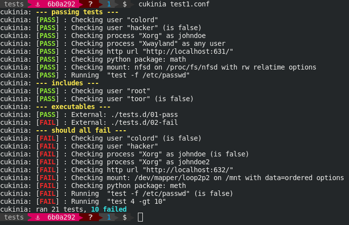

# Cukinia - a Linux firmware validation framework

Cukinia is designed to help Linux-based embedded firmware developers
run simple system-level validation tests on their firmware.

Cukinia integrates well with embedded firmware generation frameworks
such as Buildroot and Yocto, and can be run manually or by your
favourite continuous integration framework.

## Project objectives

Cukinia works if it offers the following value:

* It is very simple to use
* It requires no dependencies other than busybox
* It integrates easily with CI/CD pipelines
* It helps developers creating better software

## Usage

``cukinia [options] [config file]``

Useful options:

* `-f junitxml`: format results as JUnit XML (useful for Jenkins & others)
* `-f csv`: format results as CSV text
    * `--no-header`: omit CSV header line
* `-o file`: output results to file instead of stdout

## Screenshot



## Basic config

To run Cukinia, create a configuration describing your tests, and
invoke it. By default, cukinia reads ``/etc/cukinia/cukinia.conf``.
Alternatively, a config file can be passed to cukinia as its argument.

A cukinia config file supports the following statements:

### Test statements

* ``cukinia_user <username>``: Validates that user exists
* ``cukinia_group <groupname>``: Validates that group exists
* ``cukinia_file <filename>``: Validates that file exists
* ``cukinia_dir <directory>``: Validates that directory exists
* ``cukinia_dev_block <device path>``: Validates that block device exists
* ``cukinia_dev_char <device path>``: Validates that character device exists
* ``cukinia_process <pname> [user]``: Validates that process runs (optional user)
* ``cukinia_python_pkg <pkg>``: Validates that Python package is installed
* ``cukinia_test <expr>``: Validates that test(1) expression is true
* ``cukinia_http_request <url>``: Validates that url returns a 200 code
* ``cukinia_cmd <command>``: Validates that arbitrary command returns true
* ``cukinia_listen4 <proto> <port>``: Validates that tcp/udp port is open locally
* ``cukinia_mount <source> <mount point> [fstype] [options]``: Validate the
  presence of a mount on the system
* ``cukinia_symlink <link> <target>``: Validate the target of a symlink
* ``not``: Can prefix any test to invert the issue it will produce
* ``verbose``: Can prefix any test to preserve stdout/stderr
* ``as <string>``: Can prefix any test to change its textual description

### Utility statements

* ``cukinia_conf_include <files>``: Includes files as additional config files
* ``cukinia_run_dir <directory>``: Runs all executables in directory as individual tests
* ``cukinia_log <message>``: Logs message to stdout
* ``_ver2int <version``: Convert version string to int, for comparison with cukinia_test

### Logging customization

* ``logging prefix "string"``: prefix logs with "string"
* ``logging class "string"``: change the junitxml class name to "string" for the next tests
* ``logging suite "string"``: change the junitxml test suite to "string" for the next tests

### Useful variables

* ``$cukinia_tests``: number of tests attempted
* ``$cukinia_failures``: number of tests that failed

### Environment variables

* ``$CUKINIA_ALWAYS_PASS``: if set, every test will succeed

### Example cukinia.conf

```shell

# Ensure our basic users are present
cukinia_user appuser1
cukinia_user appuser2

# This should always be the case
cukinia_test -f /etc/passwd

# If this user exists, then something went wrong
not cukinia_user baduser

# Those config snippets are deployed by our packages
cukinia_conf_include /etc/cukinia/conf.d/*.conf

# Is our embedded webservice up?
as "Checking webapp" cukinia_http_request http://localhost:8080/sanitycheck

# Run executable tests for myapp1
cukinia_run_dir /etc/cukinia/myapp1.d/

# Check for misc. mount points
cukinia_mount sysfs /sys
cukinia_mount /dev/sda1 /boot ext4 rw sync

# Check for ssh and dns servers
cukinia_listen4 tcp 22
cukinia_listen4 udp 53

# Check the link interfaces point to /tmp/interfaces
cukinia_symlink /etc/network/interfaces /tmp/interfaces

# End
cukinia_log "ran $cukinia_tests tests, $cukinia_failures failures"
```

## More advanced config

A config file is actually a POSIX shell script that is sourced by
cukinia, so any logic can be used in a test file scenario. This is
useful for example to make certain groups of tests depend on
preliminary checks:

```shell

if cukinia_test -x /usr/bin/myapp; then
	cukinia_user myuser
	cukinia_process myapp myuser
	cukinia_http_request http://localhost:8080/testme
else
	cukinia_log "$(_colorize red "myapp not found :(")"
fi

```

## License

Cukinia is released under the Apache 2 license. In addition, it is
available under the GNU General Public License, version 3.
